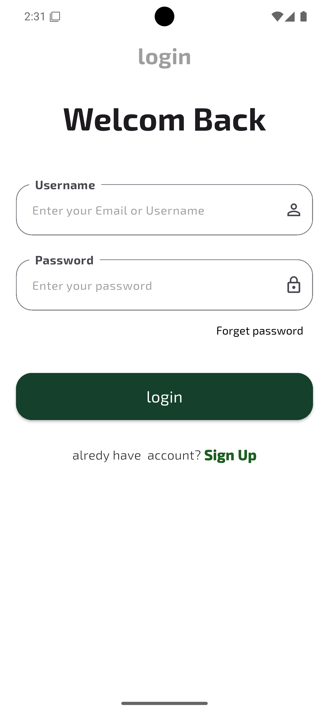
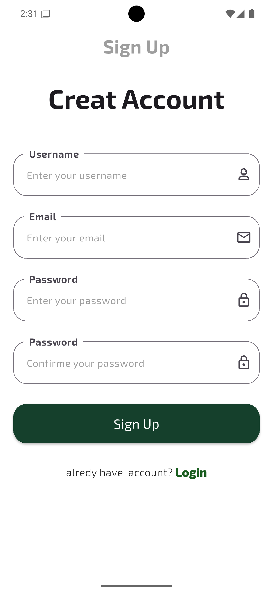
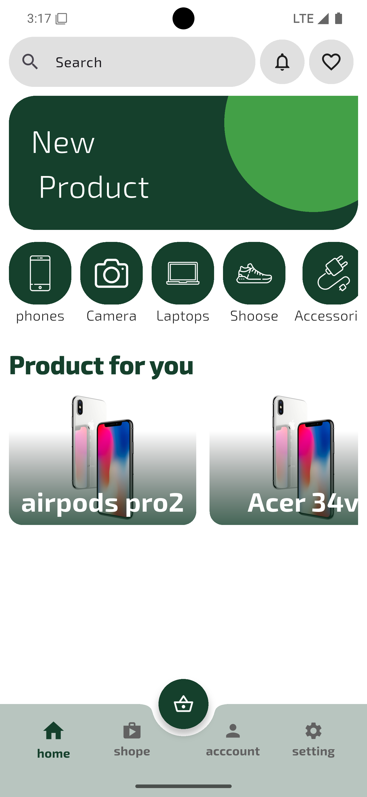
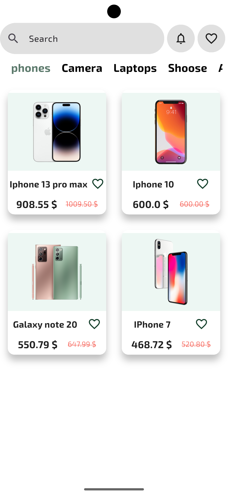
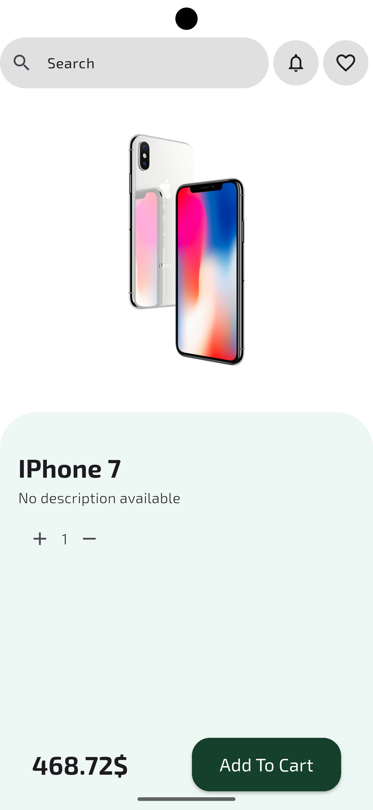
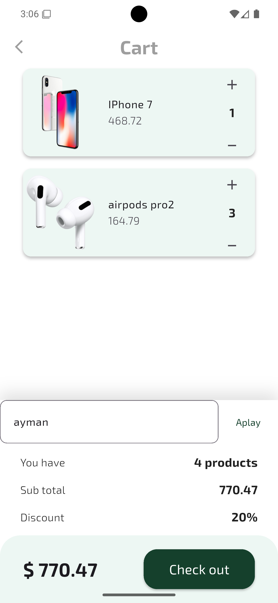
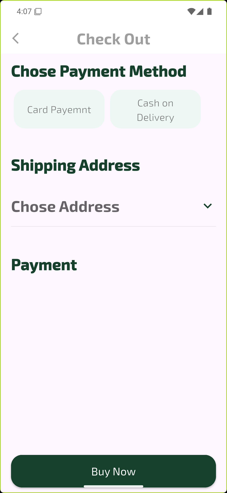
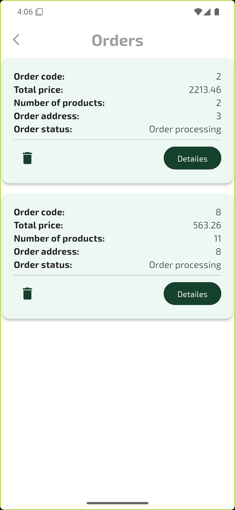
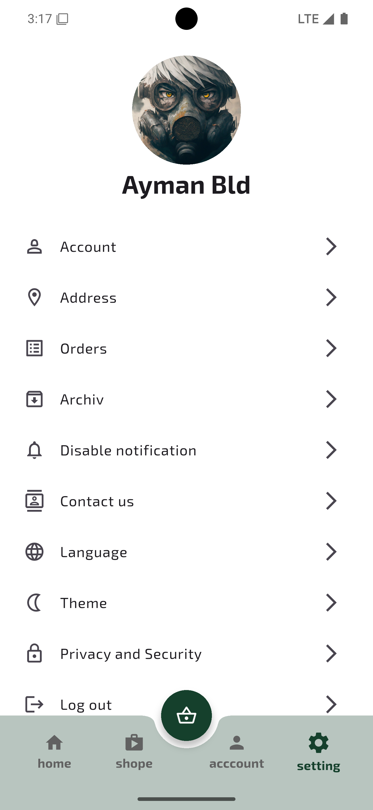

# Online Shope App

## Description
A fully functional e-commerce app built with **Flutter** and **Django** for srever side. This app allows users to browse products, add them to their cart, and complete purchases seamlessly. It includes features like user authentication, product search, and order tracking.

---

## Screenshots

<table>
<h4>Authentications screens</h4>
  <tr>
    <td></td>
    <td></td>
    <td></td>
  </tr>
</table>
<table>
  <h4>App screens</h4>
  <tr>
    <td></td>
    <td></td>
    <td></td>
  </tr>
  <tr>
    <td></td>
    <td></td>
    <td></td>
  </tr>
  <tr>
    <td></td>
  </tr>
</table>

---

## Features
- **Onboarding Screens**: Interactive introduction to the app’s features for new users.
- **User Authentication**: SignUp, login, password reset, and manage user profiles.
- **Product Browsing**: Browse products and search for specific items.
- **Product Filtering**: Filter products by category.
- **Product Details**: View detailed information about each product.
- **Favorite**: Save favorite products for later.
- **Shopping Cart**: Add/remove products and manage quantities.
- **Support order coupons**: Check for you coupon in the cart and get discount.
- **Chipping address**: Add address using map and save them.
- **Checkout**: Make orders.
- **Order History**: Track orders and their status.
- **Admin Panel**: Manage products, orders, and users (not yet).
- **Multi-language Support**: Use the app in your preferred language (English, Arabic).

## Installation
Follow these steps to run the app locally:

1. Clone the repository:
   ```bash
   git clone https://github.com/AymanBld/online-shope-app.git
2. Navigate to the project directory:
    ```bash
    cd online-shope-app
3. Install dependencies:
    ```bash
    flutter pub get
4. Run the app: 
    ```bash
    flutter run

## Acknowledgments
Thanks to the Flutter team for the amazing framework.

Inspired from the full flutter course of Wael Abo Hamza.